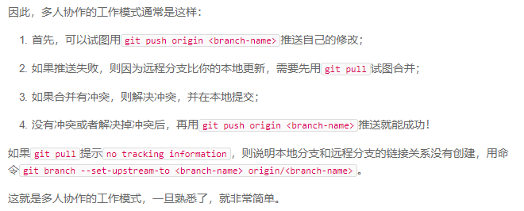

## Git学习

### 更新时间

2018.6.21

### 安装

安装完成后需要进行设置

```shell
git config --global user.name "chenqumi"
git config --global user.email "chenqumi@example.com"
```

### 创建版本库

```shell
# 初始化目录为Git仓库
git init


# 将文件放到Git仓库
git add readme.txt
git commit -m "wrote a readme file"
```

### 修改管理

```shell
git status


git diff readme.txt


git log

# 版本回退
git reset --hard HEAD^
git reset --hard 1094a


git reflog


# 修改后未add
git checkout -- readme.txt
# 修改后add了文件
git reset HEAD readme.txt
git checkout -- readme.txt
# 修改后既完成了add又完成了commit
git reset --hard HEAD^


# 删除文件
git rm test.txt
git commimt -m "remove test.txt"
# 或者误删了文件，想要还原
git checkout -- test.txt
```

### 分支管理

```shell
# 创建并切换分支
git checkout -b dev
# 或
git branch dev
git checkout dev


# 查看分支
git branch


# 在dev分支完成修改并提交后，
# 切换回master分支，合并dev后再删除dev
git checkout -b dev
do on file...
git add file
git commmit -m 'xx' file
git checkout master
git merge dev
git branch -d dev


# 合并分支时，解决冲突
# 在dev分支上完成了提交，
# 在master分支上也完成了提交，
# 在合并时提示conflict，
# 需手动修改文件再提交
git checkout -b dev
do on file...
git add file
git commmit -m 'xx' file

git checkout master
do on file...
git add file
git commmit -m 'xx' file

git merge dev
conflict...
solve congflict on file...
git add file
git commit -m 'xx' file
git branch -d dev


# 使用非Fast forward模式合并分支
# 添加--no-ff和-m参数
git checkout -b dev
do on file...
git add file
git commmit -m 'xx' file

git checkout master
git merge --no-ff -m 'xx' dev
git branch -d dev


# bug分支
# 正在dev分支工作，需修复master分支的bug
# 同时由于某些原因dev上的内容还不能提交，
# 可以使用stash命令暂存，暂存后的分支将是干净的
# 完成bug修复后再返回dev，恢复工作状态
on dev...
git stash 
# 在master上创建新分支修复bug
git checkout master
git checkout -b issue-101
do on file...
git add file
git commit -m 'xx' file
git checkout master
git merge --no-ff -m 'xx' issue-101
git branch -d issue-101

git checkout dev
# 查看stash内容
git stash list
# 恢复stash之前的工作
git stash pop
# 或
git stash apply
git stash drop

# 可以多次stash，
# 恢复时先git stash list查看，
# 再用stash apply恢复
git stash list
git stash applyt stash@{0}


# 强制删除分支
# 在dev分支上创建切换到新分支feature-vulcan，
# 完成开发后，不合并到dev，需强制删除该分支
on dev...
git checkout -b feature-vulcan
do vulcan.py...
git add vulcan.py
git commit -m 'xx' vulcan.py
git checkout dev
# 强制删除，用-D参数
git branch -D feature-vulcan

```

### 分支策略


### 远程仓库

```shell
# 创建远程仓库

# 已有本地仓库的情况下，
# GitHub创建仓库后与本地关联
on local repository...
git remote add origin git@github.com:chenqumi/learngit.git
# 将本地内容推送到GitHub
git push -u origin master

# 也可以先创建远程仓库，
# 再本地clone
git clone git@github.com:chenqumi/learngit.git


# 推送分支
git push origin master
# 推送其他分支
git push origin dev


# 抓取分支
git clone git@github.com:chenqumi/learngit.git
# 此时只会获得master分支，想获得其他分支
# 本地分支名称最好和远程分支保持一致
git checkout -b dev origin/dev

# 如推送到远程仓库失败，可能是存在提交冲突，
# 可先git pull，合并冲突后再提交
git pull
do on file...
git add file
git commit -m 'xx' file
git push origin dev
# git pull可能失败，因为没有指定
# 本地dev与远程origin/dev的链接
# 先链接再git pull
git branch --set-upstream-to=origin/dev dev
```

### 多人协作



### 标签管理

```shell
# 创建标签

# 默认是在当前HEAD创建
git tag v1.0
# 也可以指定commit id创建
git tag v0.9 ea5495b
# 使用git tag查看有哪些标签
git tag
# 使用git show <tagname>查看具体标签
git show v1.0
# 创建更为详细的标签
# git tag -a <tagname> -m 'xx' <commit id>
git tag -a v1.2 -m 'add maru' ea5495b


# 操作标签

# 推送标签至远程仓库
git push origin v1.0
# 托送所有标签到远程
git push origin --tags

# 删除本地标签
git tag -d v1.0
# 删除远程标签
# 需先删除本地标签
git tag -d v0.9
git push origin :refs/tags/v0.9
```

